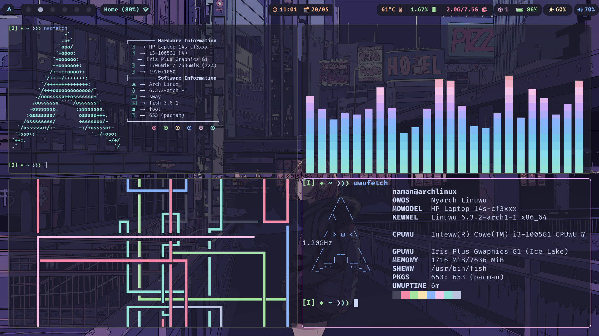
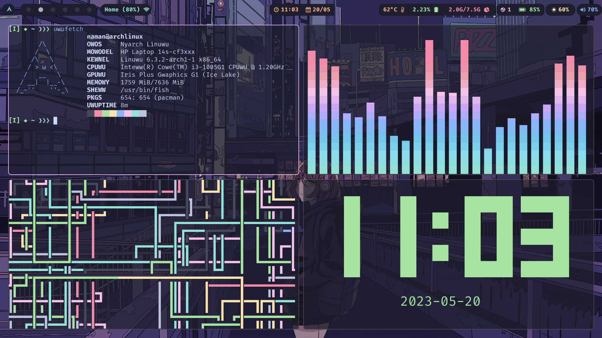

# Dotfiles


## Information

- OS: [Arch Linux](https://archlinux.org)
- WM: [Hyprland](https://hyprland.org)
- Colorscheme: [Catppuccin](https://github.com/catppuccin/catppuccin)
- Terminal: [Foot](https://codeberg.org/dnkl/foot)
- Shell: [zsh](https://www.zsh.org)
- Text Editor: [Astro nvim](https://astronvim.com)
- Application Launcher: [rofi](https://github.com/davatorium/rofi)
- Display Manager: [SDDM](https://github.com/sddm/sddm)
- Font: [Fira Code Nerd Font](https://github.com/ryanoasis/nerd-fonts)
- Bar: [Waybar](https://github.com/Alexays/Waybar)
- Browser: Firefox


## Screenshots






## Installation

Using install script

Clone this repository

```bash
git clone https://www.github.com/namanArora1022/dotfiles-hyprland.git ~/.dotfiles
cd ~/.dotfiles
chmod +x install.sh
./install.sh
```

## License

[MIT LICENSED](./LICENSE)


